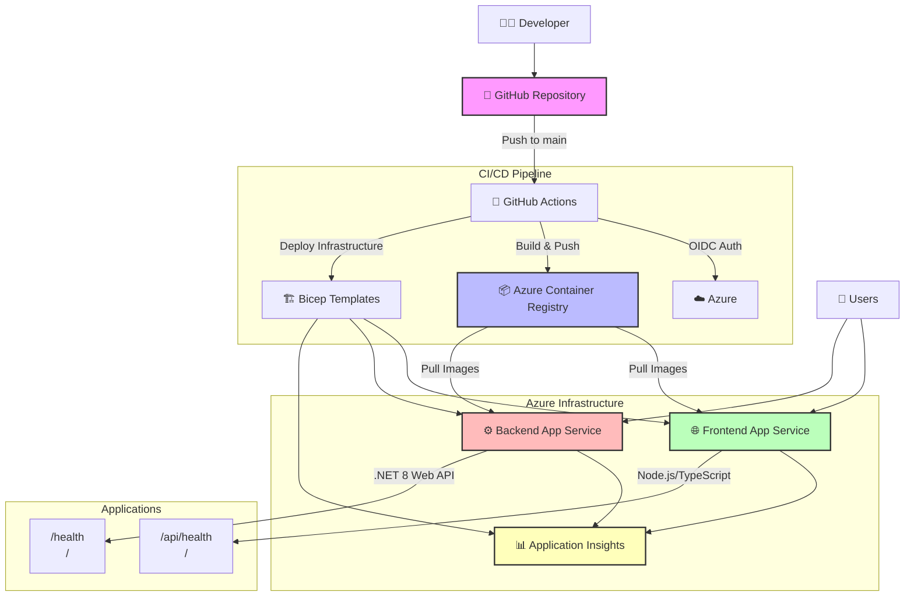

# work-with-containers

GitHub ActionsとAzureのコンテナサービスを使ったデモ

## 概要

このプロジェクトは、GitHub ActionsとAzure Container Registry (ACR) を使用してコンテナイメージのビルドとデプロイを自動化するデモアプリケーションです。

## アーキテクチャ



### 技術スタック

- **フロントエンド**: Node.js + TypeScript (Express サーバー)
- **バックエンド**: .NET 8 Web API
- **コンテナレジストリ**: Azure Container Registry (ACR)
- **ホスティング**: Azure App Service on Linux
- **監視**: Application Insights
- **CI/CD**: GitHub Actions (OIDC認証)
- **インフラ**: Bicep テンプレート

## セットアップ

### 前提条件

1. Azure Container Registry `crworkithcontainer001` が `rg-container-demo` リソースグループに作成済み
2. GitHub SecretsにOIDC認証用の以下の値が設定済み:
   - `AZURE_CLIENT_ID`
   - `AZURE_TENANT_ID` 
   - `AZURE_SUBSCRIPTION_ID`

### ローカル開発

#### フロントエンド
```bash
cd frontend
npm install
npm run dev
```

#### バックエンド
```bash
cd backend
dotnet run
```

### デプロイ

1. **インフラストラクチャのデプロイ**:
```bash
az deployment group create \
  --resource-group rg-container-demo \
  --template-file bicep/main.bicep \
  --parameters @bicep/main.parameters.json
```

2. **コンテナイメージのビルドとプッシュ**:
   - `main` ブランチへの push により GitHub Actions が自動実行されます

## エンドポイント

- フロントエンド: `GET /` - Hello World メッセージを返す
- フロントエンド: `GET /health` - ヘルスチェック
- バックエンド: `GET /` - Hello World メッセージを返す  
- バックエンド: `GET /health` - ヘルスチェック

## セキュリティ

- OIDC認証によりService Principalのクレデンシャルレス化を実現
- GitHub Secretsで認証情報を安全に管理
